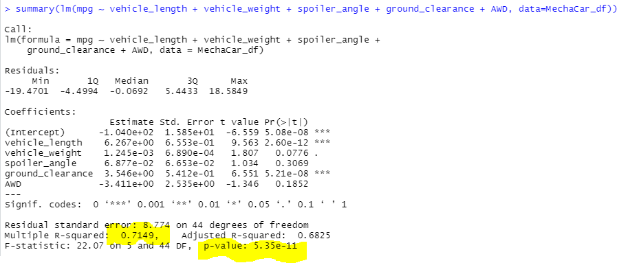
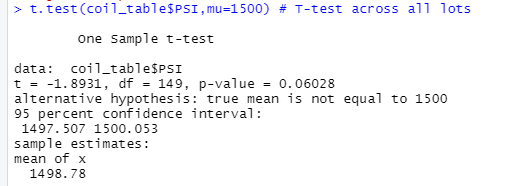

# MechaCar_Statistical_Analysis

## Linear Regression to Predict MPG
- Vehicle Length and Ground Clearance are significant because their p-values indicate that changes in the independent variable's value are related to changes in the dependent variable and we can reject the null hypothesis.

- The slope of this linear model is not considered to be zero because our correlation coefficient is .8455 and the higher the correlation is between variables, the more that we can explain/predict the value of the other.

- The slope of this linear model is not considered to be zero because our R-Squared value is 0.7149 which means that roughly 71% of the variability of our dependent variable is explained using this linear model

## Summary Statistics on Suspension Coils

- The design specifications for the MechaCar suspension coils dictate that the variance of the suspension coils must not exceed 100 pounds per square inch. 

- The variance of the suspension coils exceeded 100 lbs per square inch in Lot 3. Lot 3 does not meet the design specifications.

- The total summary variance of 62.3 lbs per square inch meets the design specifications for MechaCar.

## T-Tests on Suspension Coils

summarize your interpretation and findings for the t-test results. Include screenshots of the t-test to support your summary.

- T-Test Across All Lots: Since our p-value is .06 (greater then our significance of .05), we fail to reject the null hypothesis. Based on these results, the true mean across all lots is equal to 1500.

- T-Test Lot 1: Lot 1 is not statistically different from the population mean of 1500 lbs per square inch.

- T-Test Lot 2: Lot 2 is not statistically different from the population mean of 1500 lbs per square inch.

- T-Test Lot 3: Lot 3 is statistically different from the population mean of 1500 lbs per square inch. The p-value is 0.04 which is less than our significance level of .05, therefore, we must reject the null hypothesis that there is no statistical difference. 
